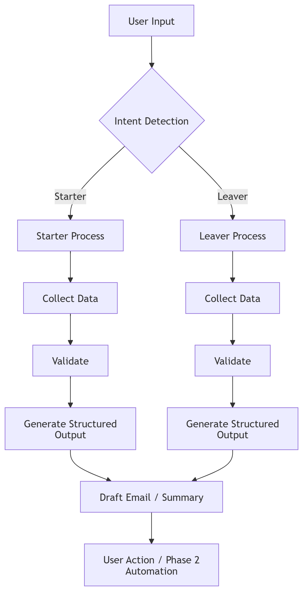

# hr-lifecycle-copilot-agent

HR Lifecycle Copilot is an AI agent built in Copilot Studio to support managers, HR staff, and ICT teams with Starter and Leaver processes. The agent guides users step-by-step, validates inputs to reduce rework, and produces structured outputs (summaries, draft messages, sending emails) that teams can action immediately.
